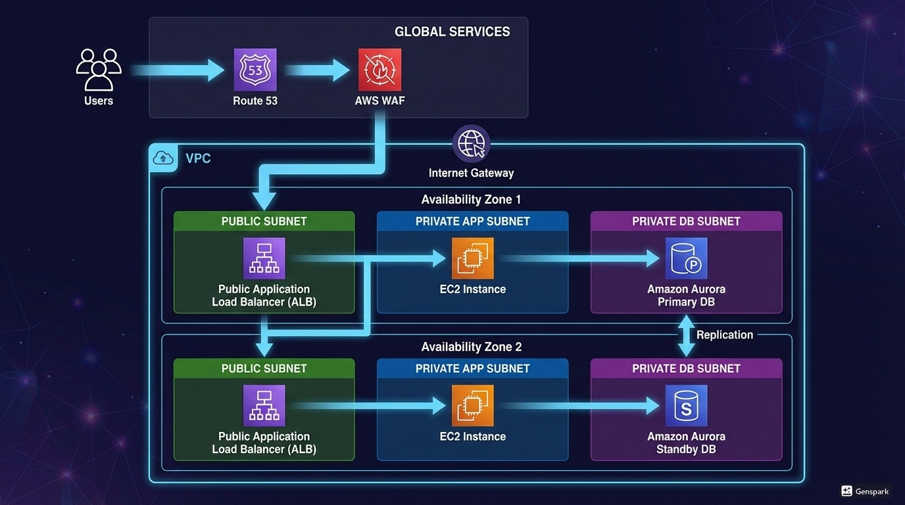

# 🚀 AWS 3-Tier Architecture with High Availability & Fault Tolerance

A production-style AWS 3-Tier Architecture built using DevOps best practices focusing on **scalability, security, fault tolerance, and high availability**.

---

## 📌 Project Overview

This project demonstrates deployment of a scalable application using a **3-tier cloud architecture**:

- **Web Tier (Presentation Layer)** – Serves frontend content
- **Application Tier (Business Logic Layer)** – Handles APIs and backend logic
- **Database Tier (Data Layer)** – Stores data securely in Amazon RDS

Traffic Flow:

Route53 → External ALB → Web Tier → Internal ALB → App Tier → RDS

---

## 🎯 Project Objectives

- Design secure and scalable AWS infrastructure
- Separate Web, App, and Database tiers
- Implement internal & external load balancing
- Enable auto scaling for high availability
- Deploy backend in private subnets
- Secure traffic using HTTPS (SSL)
- Map custom domain using Route 53

---

## 🧠 Architecture Diagram

📌 **Add your architecture diagram here**

---

## ☁️ AWS Services Used

- Amazon VPC
- Public & Private Subnets
- Internet Gateway
- NAT Gateway
- Amazon EC2
- Amazon S3
- IAM Roles
- Amazon RDS (MySQL Multi-AZ)
- Application Load Balancer (External & Internal)
- Auto Scaling Group
- AWS Certificate Manager (ACM)
- Amazon Route 53

---

## 🌐 End-to-End Request Flow

1. User accesses application via custom domain.
2. Route 53 resolves DNS and forwards traffic to External ALB.
3. External ALB routes requests to Web Tier instances.
4. Web Tier serves frontend and forwards API requests.
5. Internal ALB sends traffic to App Tier.
6. App Tier processes logic and communicates with RDS.
7. Response travels back through the same path.

---

## 🏗️ Architecture Screenshots

### 1️⃣ VPC Overview (Subnets + AZ Setup)

---

### 2️⃣ External Application Load Balancer

---

### 3️⃣ Internal Application Load Balancer

---

### 4️⃣ Auto Scaling Group (App Tier)

---

### 5️⃣ RDS Multi-AZ Configuration

---

### 6️⃣ Route53 + SSL Certificate (ACM)

---

### 7️⃣ Final Application Access via Custom Domain

---

## 🚀 Deployment Steps (High Level)

### STEP 1 — VPC & Networking
- Create VPC
- Public & private subnets
- Internet Gateway
- NAT Gateway
- Route tables

### STEP 2 — S3 & IAM
- Upload application code to S3
- Create IAM role for EC2 S3 access

### STEP 3 — Database Tier
- Create RDS MySQL instance
- Multi-AZ enabled
- Private DB subnet group

### STEP 4 — Application Tier
- Launch App Tier EC2 in private subnet
- Install runtime
- Connect to RDS
- Configure Internal ALB

### STEP 5 — Web Tier
- Deploy frontend
- Configure NGINX reverse proxy
- Setup External ALB

### STEP 6 — Validation
- Verify end-to-end traffic flow

### STEP 7 — Auto Scaling
- Create AMI
- Launch template
- Configure ASG

### STEP 8 — SSL + Domain
- Request ACM certificate
- Setup Route53 hosted zone
- Enable HTTPS listener on ALB

### STEP 9 — Final Access
- Access app securely using custom domain

---

## 🔐 Security Implementation

- Tier-based Security Groups
- Private App & DB subnets
- Internal Load Balancer for APIs
- RDS not publicly accessible
- SSL/TLS enabled via ACM
- IAM roles instead of access keys

---

## ⚡ DevOps Skills Demonstrated

- AWS Networking (VPC design)
- Load Balancing Strategy
- High Availability Architecture
- Auto Scaling
- Linux & Nginx Configuration
- Secure Cloud Design
- Production-style Infrastructure Thinking

---

## 📂 Repository Structure

